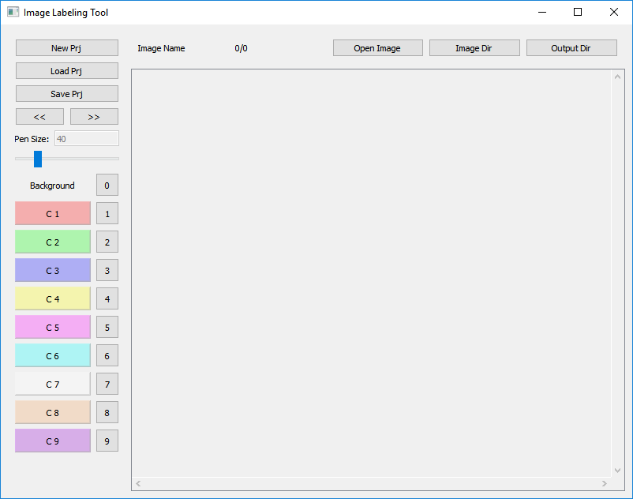

# Image Labeling Tool
Source code for the Image Labeling Tool Developed by Andreas Bartschat. Re-uploaded since the original repository (https://bitbucket.org/abartschat/imagelabelingtool) was deleted.

Note: This was _not_ developed by me! This repository is used to prevent the source code from being lost.

# Original Readme:

Simple C++/Qt based GUI for drawing segmentation labels on images. The labels are saved as a grayscale label image and an additional image with colored overlay.

Please keep in mind that this is an open source project, use at own risk!
To report bugs and suggestions please use the Issue Tracker.

## Use and shortcuts:
 * change color:
    * use numbers 0-9 
    * or press the button next to the color

 * paint:
    * paint on background: leftclick
    * overpaint (paint on background and label): ctrl + leftclick
    * change pen size: mouse wheel

 * area coloring:
    * coloring of background: leftclick on color
    * overpaint everything: ctrl + leftclick on color
 * zoom: ctrl + mouse wheel
 * move image: hold rightclick

 * undo: ctrl+z
 * save: ctrl+s
 * next image: -> (arrow key)

## Compilation
Only Qt is required. The commercial and open source version of Qt can be found on the [Qt website](https://www.qt.io/).

FAQ: If GL libs are missing on Ubuntu: sudo apt install libgl1-mesa-dev

## Binaries
The zip files can be found in downloads and the Windows version was created with Visual Studio 2017 64bit and tested on a few Win10 machines.

## License
LGPLv3
